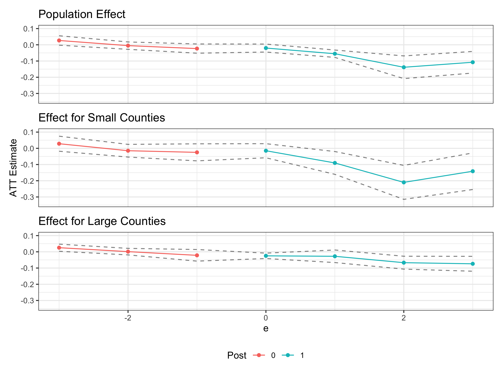
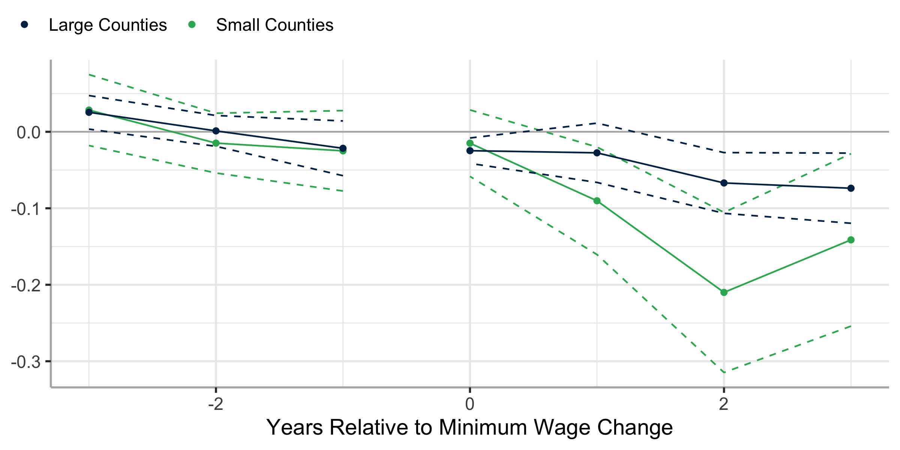

<style>
/* brant customizations */
.alert {
  color: #BA0C2F;
  font-weight: 400;
}
.alert-blue {
  color: #00A3AD;
  font-weight: 400;
}
span.citation {
  color: #007acc;
  font-weight: bold;
}
span.notation {
  color: #007acc;
  font-weight: bold;
}
.csl-entry {
  margin-bottom: 0.5em;
}
div.citation {
  border: 3px solid #ccc;
  padding: 25px;
  margin-top: 25px;
  margin-bottom: 25px;
}
blockquote {
  background-color: #f9f9f9; /* Light gray background */
  border-left: 5px solid #ccc; /* Gray border on the left */
  padding: 15px; /* Add some padding inside */
  margin: 20px 0; /* Space around the block */
  font-style: normal; /* Override italic if applied by default */
}
</style>

This post addresses a common question we have been asked regarding “I
have used the Callaway and Sant’Anna” estimator to estimate some average
treatment effect for a population, but want to see if the treatment
effect varies along different dimensions. This could be for units of
different groups like gender, race, or college-degree (discrete $Z_i$)
or for binned/discretized continuous variables like age-bins
(discretized $Z_i$). The goal is to estimate the group-time ATT for
subgroups defined by a specific $Z_i = z$ for a given value of $z$.

One way you can think about the Callaway and Sant’Anna approach is that
it provides a sort of rubric for how to estimate aggregate parameters:
if you can devise a way to estimate an effect for a $(g, t)$, then the
aggregating up the “$(g,t)$ building blocks” to say an event-study
(dynamic) or an overall treatment effect is “standard”.

Brantly has even invested in creating a package,
[`pte`](https://github.com/bcallaway11/pte), which allows for a
“plug-in-play” approach to this. In this package, Brant does all the
wiring and you only have to tell it how to estimate the treatment effect
for a given $(g, t)$ dataset.

In this post, we will disucss estimating a subgroup-specific $ATT(g,t)$
and then show how to code this in the `pte` package. A complete example
is available in this [gist](TODO:%20gist.github.com/).

## Subgroup-$ATT(g,t)$

The basic set-up follows Callaway and Sant’Anna where you observe units
treated at different points in time, denoted by $g$. You are willing to
impose that conditional on a vector of baseline characteristics $X_i$,
parallel trends hold:

$$
  \mathbb{E}\left( Y_{it}(0) - Y_{i,g-1}(0) \ | \ D_i = 1, X_i \right) = 
  \mathbb{E}\left( Y_{it}(0) - Y_{i,g-1}(0) \ | \ D_i = 0, X_i \right),
$$

Notice this is effectively a selection-on-observables assumption, but
instead of $Y_{i}$, we are looking at the differenced data
$Y_{it}(0) - Y_{i,g-1}(0)$ and arguing the mph{change} in untreated $Y$
is independent of $D$ conditional on $X$.

Then, what the Callaway and Sant’Anna estimator is combine
inverse-probability of treatment weighting with a regression adjustment
(a so called \`doubly-robust’ method). The regression adjustment fits a
model using the untreated units $(D_i = 0)$:

$$
  Y_{it}(0) - Y_{i,g-1}(0) = \alpha_0 + X_i \beta_0 + u_i
$$

which predicts changes in $Y(0)$ given $X_i$. I denote $\alpha$ and
$\beta$ with $_0$ to emphasize this is a model for $Y(0)$. This model
can then predict the counterfactaul change in $Y$ for the treated units
by plugging in the treated unit’s $X_i$:

$$
  \underbrace{ \mathbb{E}\left( Y_{it}(0) - Y_{i,g-1}(0) \ | \ D_i = 1 \right) }_{\text{Imputed  counterfactual}} \approx \frac{1}{N_1} \sum_{i \ : \ D_i = 1} \hat{\alpha}_0 + X_i \hat{\beta}_0
$$

This is then compared to the observed
$\frac{1}{N_1} \sum_{i \ : \ D_i = 1} \left( Y_{it} - Y_{i,g-1} \right)$
to form the DID estimate.

For estimating subgroup average effects, we can modify the procedure to
take averages of

$$
  \left( Y_{it} - Y_{i,g-1} \right) - \left( \hat{\alpha}_0 + X_i \hat{\beta}_0 \right)
$$

for different subgroups defined by $Z_i = z$.

This procedure is valid if $Z_i$ is one of the covariates you use in
your conditional parallel trends assumption (passed in `xformla`). If
you do not include $Z_i$ in $X_i$, then you are assuming that trends do
not vary by $Z_i = z$ which can be a strong assumption (do trends vary
by large / smaller counties).

## Coding implementation using `pte`

We will use a dataset from the `did` package of teen employment in 500
counties in the U.S. from 2004 to 2007. The main outcome variable is
`lemp` which is the log of teen employment and the we will look if
minimum wage changes have larger or smaller effects in small counties
(based on `lpop`). First, let’s load packages and the dataset.

``` r
library(did)
library(pte) # devtools::install_github("bcallaway11/pte")
library(BMisc) # devtools::install_github("bcallaway11/BMisc")
library(fixest)

# Load example minimum wage dataset
data(mpdta, package = "did")

# Discretize population into above and below median
mpdta$large_county <- mpdta$lpop >= quantile(mpdta$lpop, 0.50)

head(mpdta)
```

        year countyreal     lpop     lemp first.treat treat large_county
    866 2003       8001 5.896761 8.461469        2007     1         TRUE
    841 2004       8001 5.896761 8.336870        2007     1         TRUE
    842 2005       8001 5.896761 8.340217        2007     1         TRUE
    819 2006       8001 5.896761 8.378161        2007     1         TRUE
    827 2007       8001 5.896761 8.487352        2007     1         TRUE
    937 2003       8019 2.232377 4.997212        2007     1        FALSE

The main thing that `pte` requires of the user is a function to take a
dataframe for a given $(g,t)$ and produce a treatment effect estimate.
The dataset is effectively your original dataframe subsetted with a few
additional variables. To peek under the hood, this is what the data
looks like

``` r
# NOTE: you do not need to do this, but it's helpful to have an example to test your estimation function on
pte_data <- pte::setup_pte(
  yname = "lemp", gname = "first.treat", tname = "year", idname = "countyreal", data = mpdta
)$data
# g = 2004, t = 2007
gt_data <- two_by_two_subset(pte_data, g = 2, tp = 5)$gt_data

head(gt_data)
```

         year countyreal     lpop     lemp first.treat treat large_county G    id
    2203 2003      13011 2.668755 5.273000           0     0        FALSE 0 13011
    2207 2007      13011 2.668755 5.572154           0     0        FALSE 0 13011
    2210 2003      13013 3.831767 6.188264           0     0         TRUE 0 13013
    2214 2007      13013 3.831767 6.401917           0     0         TRUE 0 13013
    2231 2003      13019 2.787169 5.564520           0     0        FALSE 0 13019
    2235 2007      13019 2.787169 4.997212           0     0        FALSE 0 13019
                Y .w period name D
    2203 5.273000  1      1  pre 0
    2207 5.572154  1      5 post 0
    2210 6.188264  1      1  pre 0
    2214 6.401917  1      5 post 0
    2231 5.564520  1      1  pre 0
    2235 4.997212  1      5 post 0

Note we have `G`, `id`, `Y` (outcome), `.w` (weights if provided),
`period` (shifted version of original time), `name` (pre/post), and `D`
(treatment).

Let’s define our function. This accepts `gt_data`, the `xformla` passed,
and a custom argument called `subgroup` which lets you pass an
expression to subset the treated group (e.g. `large_county == TRUE`)

``` r
#' Subgroup ATT(g,t) estimation function
#'
#' Leave `subgroup` unspecified (or `NULL` to estimate overall ATT(g,t)
#' Otherwise pass expression to `subgroup` to subset the treated units to a subgroup
#'
did_attgt_subgroup <- function(gt_data, xformla, subgroup = NULL, ...) {
  # convert two period panel into wide with `pre` and `post`
  data_pre <- gt_data[gt_data$name == "pre", ]
  names(data_pre)[names(data_pre) == "Y"] <- "Y_pre"

  data_post <- gt_data[gt_data$name == "post", ]
  names(data_post)[names(data_post) == "Y"] <- "Y_post"
  data_post <- data_post[, c("id", "Y_post")]

  # One row per unit
  wide_data <- merge(data_pre, data_post, by = "id")

  # \Delta Y = Y_{i,t} - Y_{i,g-1}
  wide_data$delta_Y <- wide_data$Y_post - wide_data$Y_pre

  # Fit model using D == 0
  outcome_reg <- fixest::feols(
    fixest::xpd(lhs = "delta_Y", fml = xformla),
    data = wide_data[wide_data$D == 0, ] # never-treated and/or not-yet-treated
  )

  # Predict Y_{it}(0) - Y_{i,g-1}(0) for everyone
  wide_data$delta_Y0_hat <- predict(outcome_reg, newdata = wide_data)

  # Difference between observed delta_y and predicted delta_Y0_hat
  wide_data$diff <- wide_data$delta_Y - wide_data$delta_Y0_hat

  # Get treated units
  treat <- wide_data[wide_data$D == 1, ]

  # Using a little quosure magic to allow `subgroup` to be passed in as an argument
  subgroup <- rlang::enquo(subgroup)
  if (!rlang::quo_is_null(subgroup)) {
    subgroup <- rlang::eval_tidy(subgroup, data = treat)
    treat <- treat[subgroup, ]
  }

  # Estimate ATT for treated units
  attgt <- mean(treat$diff)
  return(list(attgt = attgt))
}
```

Now, with that function defined we can use it with `pte`. The function
takes very similar arguments to `did` (variable names and `xformla`),
but requires a few extra arguments (`setup_pte_fun` and `subset_fun`)
given the extra flexibility given by the `pte` package.

``` r
# Overall ATT
did_res <- pte(
  data = mpdta,
  yname = "lemp",
  gname = "first.treat",
  tname = "year",
  idname = "countyreal",
  xformla = ~lpop,
  setup_pte_fun = pte::setup_pte,
  subset_fun = pte::two_by_two_subset,
  # base_period = "universal",
  biters = 50,
  # No subgroup filter so it estimates an overal ATT(g,t)
  attgt_fun = did_attgt_subgroup
)
summary(did_res)
```


    Overall ATT:  
         ATT    Std. Error     [ 95%  Conf. Int.]  
     -0.0323        0.0127    -0.0572     -0.0073 *


    Dynamic Effects:
     Event Time Estimate Std. Error [95% Pointwise  Conf. Band]  
             -3   0.0267     0.0148         -0.0023      0.0558  
             -2  -0.0051     0.0116         -0.0279      0.0176  
             -1  -0.0233     0.0145         -0.0517      0.0051  
              0  -0.0200     0.0125         -0.0446      0.0046  
              1  -0.0550     0.0115         -0.0776     -0.0323 *
              2  -0.1385     0.0357         -0.2085     -0.0685 *
              3  -0.1075     0.0340         -0.1742     -0.0409 *
    ---
    Signif. codes: `*' confidence band does not cover 0

``` r
# Check similar results using `did` when using Outcome Regression
did::aggte(
  did::att_gt(
    data = mpdta,
    yname = "lemp",
    gname = "first.treat",
    tname = "year",
    idname = "countyreal",
    xformla = ~lpop,
    est_method = "reg"
  ),
  "dynamic"
)
```


    Call:
    did::aggte(MP = did::att_gt(data = mpdta, yname = "lemp", gname = "first.treat", 
        tname = "year", idname = "countyreal", xformla = ~lpop, est_method = "reg"), 
        type = "dynamic")

    Reference: Callaway, Brantly and Pedro H.C. Sant'Anna.  "Difference-in-Differences with Multiple Time Periods." Journal of Econometrics, Vol. 225, No. 2, pp. 200-230, 2021. <https://doi.org/10.1016/j.jeconom.2020.12.001>, <https://arxiv.org/abs/1803.09015> 


    Overall summary of ATT's based on event-study/dynamic aggregation:  
         ATT    Std. Error     [ 95%  Conf. Int.]  
     -0.0808        0.0187    -0.1174     -0.0441 *


    Dynamic Effects:
     Event time Estimate Std. Error [95% Simult.  Conf. Band]  
             -3   0.0264     0.0142       -0.0097      0.0624  
             -2  -0.0041     0.0130       -0.0371      0.0288  
             -1  -0.0235     0.0146       -0.0607      0.0138  
              0  -0.0211     0.0117       -0.0509      0.0086  
              1  -0.0534     0.0163       -0.0949     -0.0118 *
              2  -0.1411     0.0394       -0.2414     -0.0408 *
              3  -0.1075     0.0332       -0.1921     -0.0230 *
    ---
    Signif. codes: `*' confidence band does not cover 0

    Control Group:  Never Treated,  Anticipation Periods:  0
    Estimation Method:  Outcome Regression

Now, we can pass the `subgroup` argument to estimate effects for large
counties and for small counties separately.

``` r
did_res_Z0 <- pte(
  data = mpdta,
  yname = "lemp",
  gname = "first.treat",
  tname = "year",
  idname = "countyreal",
  xformla = ~lpop,
  setup_pte_fun = pte::setup_pte,
  subset_fun = pte::two_by_two_subset,
  # base_period = "universal",
  biters = 50,
  attgt_fun = did_attgt_subgroup,
  subgroup = (large_county == FALSE)
)
summary(did_res_Z0)
```


    Overall ATT:  
         ATT    Std. Error     [ 95%  Conf. Int.] 
     -0.0301        0.0233    -0.0757      0.0154 


    Dynamic Effects:
     Event Time Estimate Std. Error [95% Pointwise  Conf. Band]  
             -3   0.0284     0.0237         -0.0180      0.0748  
             -2  -0.0148     0.0199         -0.0539      0.0243  
             -1  -0.0249     0.0268         -0.0774      0.0277  
              0  -0.0149     0.0222         -0.0583      0.0286  
              1  -0.0902     0.0358         -0.1605     -0.0199 *
              2  -0.2100     0.0534         -0.3147     -0.1054 *
              3  -0.1413     0.0575         -0.2541     -0.0286 *
    ---
    Signif. codes: `*' confidence band does not cover 0

``` r
did_res_Z1 <- pte(
  data = mpdta,
  yname = "lemp",
  gname = "first.treat",
  tname = "year",
  idname = "countyreal",
  xformla = ~lpop,
  setup_pte_fun = pte::setup_pte,
  subset_fun = pte::two_by_two_subset,
  # base_period = "universal",
  biters = 50,
  attgt_fun = did_attgt_subgroup,
  subgroup = (large_county == TRUE)
)
summary(did_res_Z1)
```


    Overall ATT:  
         ATT    Std. Error     [ 95%  Conf. Int.]  
     -0.0338        0.0086    -0.0508     -0.0169 *


    Dynamic Effects:
     Event Time Estimate Std. Error [95% Pointwise  Conf. Band]  
             -3   0.0255     0.0112          0.0035      0.0474 *
             -2   0.0012     0.0103         -0.0190      0.0213  
             -1  -0.0216     0.0183         -0.0574      0.0142  
              0  -0.0247     0.0085         -0.0413     -0.0081 *
              1  -0.0275     0.0198         -0.0662      0.0113  
              2  -0.0669     0.0203         -0.1066     -0.0272 *
              3  -0.0738     0.0234         -0.1196     -0.0279 *
    ---
    Signif. codes: `*' confidence band does not cover 0

### Plotting results

``` r
library(ggplot2)
library(patchwork)
plot_overall <- pte:::ggpte(did_res) +
  labs(title = "Population Effect") +
  theme(legend.position = "bottom")

plot_Z0 <- pte:::ggpte(did_res_Z0) +
  labs(title = "Effect for Small Counties") +
  theme(legend.position = "bottom")

plot_Z1 <- pte:::ggpte(did_res_Z1) +
  labs(title = "Effect for Large Counties") +
  theme(legend.position = "bottom")

# Combine figures into one plot
((plot_overall / plot_Z0 / plot_Z1) &
  scale_y_continuous(limits = c(-0.34, 0.1)) &
  labs(y = "ATT Estimate", color = "Post") &
  theme(legend.position = "bottom")
) +
  plot_layout(axes = "collect", guides = "collect")
```



Or, you can extract the event-study estimates directly using `summary()`
and plot the estimates however you wish.

``` r
plot_df_Z0 <- summary(did_res_Z0)$event_study
  colnames(plot_df_Z0) <- c("e", "att", "se", "cil", "ciu")
plot_df_Z1 <- summary(did_res_Z1)$event_study
colnames(plot_df_Z1) <- c("e", "att", "se", "cil", "ciu")

ggplot() +
  geom_hline(yintercept = 0, color = "grey70") + 
  geom_line(
    aes(x = e, y = att, color = "Small Counties", group = (e >= 0)),
    data = plot_df_Z0
  ) +
  geom_point(
    aes(x = e, y = att, color = "Small Counties"),
    data = plot_df_Z0
  ) +
  geom_ribbon(
    aes(x = e, ymin = cil, ymax = ciu, color = "Small Counties", group = (e >= 0)),
    data = plot_df_Z0,
    fill = NA, linetype = "dashed"
  ) +
  geom_line(
    aes(x = e, y = att, color = "Large Counties", group = (e >= 0)),
    data = plot_df_Z1
  ) +
  geom_point(
    aes(x = e, y = att, color = "Large Counties"),
    data = plot_df_Z1
  ) +
  geom_ribbon(
    aes(x = e, ymin = cil, ymax = ciu, color = "Large Counties", group = (e >= 0)),
    data = plot_df_Z1,
    fill = NA, linetype = "dashed"
  ) +
  labs(x = "Years Relative to Minimum Wage Change", y = NULL, color = NULL) + 
  scale_color_manual(
    values = c(
      "Large Counties" = "#002C55",
      "Small Counties" = "#2DB25F"
    ),
    guide = guide_legend(override.aes = list(linetype = "blank"))
  ) +
  theme_bw(base_size = 14) +
  theme(
    panel.border = element_blank(), axis.line = element_line(color = "grey70"),
    legend.position = "top", 
    legend.margin = margin(0, 0, 0, 0),
    legend.justification = c(0, 1), 
    legend.location = "plot"
  )
```



# References

> <span class="citation">Citation:</span>
>
> <pre>
> @online{callaway-unconfoundedness-regressions-2024,
>   author       = {Callaway, Brantly},
>   title        = {Interpreting Regressions under the Assumption of Unconfoundedness},
>   year         = {2024},
>   month        = {11},
>   url          = {https://bcallaway11.github.io/posts/unconfoundedness-regressions},
>   urldate      = {\today},
> }
> </pre>
