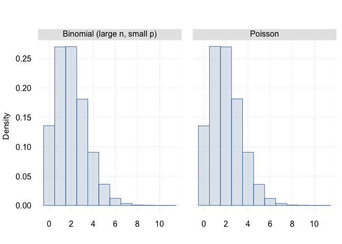
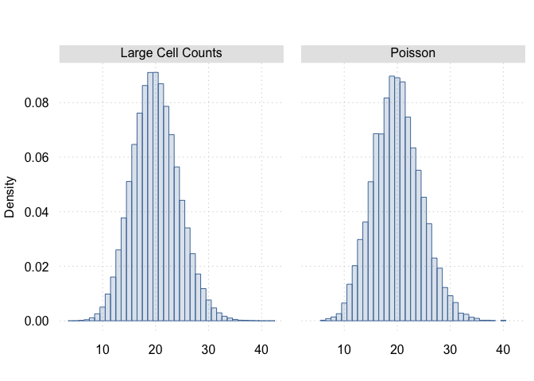

# Law of Rare Events / Poisson Limit Theorem

This famous theorem states that when you have:

- A large number of independent trials ($n \to \infty$)
- Each trial has a small probability of success ($p \to 0$)
- The expected number of successes ($\lambda = np$) remains constant

$\implies$ the number of successes $X$ follows a Poisson distribution
with parameter $\lambda$

## Sketch of proof:

The binomial distribution with $n$ trials and probability of success $p$
has probability mass function:

$$
  \mathbb{P}(X = k) = {n \choose k} p^{k} (1-p)^{n - k}
$$

Using $p = \lambda / n$:

$$\mathbb{P}(X = k) = {n \choose k} (\lambda/n)^{k} (1-\lambda/n)^{n - k}$$

Through algebraic manipulation and using the limit as $n \to \infty$:

$$\mathbb{P}(X = k) = (\lambda^{k} e^{-\lambda}) / k!$$

## Simulation:

``` r
set.seed(20250216)

# Poisson intensity parameter
lambda <- 2 

# large $n$ with small $p$
n <- 100000
p <- lambda / n


# Simulate draws from poisson distribution and from many independent Bernoulli trials
B <- 500000
draws_binom <- rbinom(n = B, size = n, prob = p)
# equivalent, but much slower:
# draws_binom <- replicate(B, { sum(runif(n) <= p) })
draws_poisson <- rpois(B, lambda = lambda)
```

``` r
# Comparing empirical distribution
table(draws_binom) / B
```

    draws_binom
           0        1        2        3        4        5        6        7 
    0.135834 0.269874 0.270208 0.180854 0.090558 0.036096 0.012078 0.003396 
           8        9       10       11 
    0.000870 0.000192 0.000038 0.000002 

``` r
table(draws_poisson) / B
```

    draws_poisson
           0        1        2        3        4        5        6        7 
    0.135438 0.270674 0.269854 0.181228 0.090568 0.035796 0.011954 0.003410 
           8        9       10       11 
    0.000848 0.000198 0.000026 0.000006 

``` r
library(tinyplot)
tinytheme("clean2")
res <- rbind(
  data.frame(type = "Binomial (large n, small p)", draws = draws_binom),
  data.frame(type = "Poisson", draws = draws_poisson)
)
tinyplot(
  ~ draws, facet = ~type, 
  data = res, 
  type = "histogram", 
  freq = FALSE,
  breaks = -0.5 + 0:(max(res$draws) + 1),
  xlab = ""
)
```



------------------------------------------------------------------------

``` r
library(tidyverse)
library(spatstat)
```

    Loading required package: spatstat.data

    Loading required package: spatstat.univar

    spatstat.univar 3.1-1

    Loading required package: spatstat.geom

    spatstat.geom 3.3-5

    Loading required package: spatstat.random

    spatstat.random 3.3-2

    Loading required package: spatstat.explore

    Loading required package: nlme


    Attaching package: 'nlme'

    The following object is masked from 'package:dplyr':

        collapse

    spatstat.explore 3.3-4

    Loading required package: spatstat.model

    Loading required package: rpart

    spatstat.model 3.3-4

    Loading required package: spatstat.linnet

    spatstat.linnet 3.2-5


    spatstat 3.3-1 
    For an introduction to spatstat, type 'beginner' 

``` r
set.seed(20250216)
```

## Poisson with small intensity is approximately Bernoulli

Thing 1 to notice:

when lambda is small enough, x can (w.p.a. 1) only obtain 0 and 1. The
probability you get a 1 is $\approx \lambda$

``` r
poisson_small_lambda_is_approx_bernoulli <- function(lambda = 0.001) {
  if (lambda < 0.00001) {
    stop("lambda is too small for this numerical simulation to be precise")
  }
  B <- max(10000, 10 * (1 / lambda))
  x <- rpois(B, lambda = lambda)
  pct <- table(x, dnn = NULL) / B

  cat(sprintf(
    "Lambda: %s\nFreq. of draws: \n",
    lambda
  ))
  print(pct)
}
poisson_small_lambda_is_approx_bernoulli(lambda = 0.1)
```

    Lambda: 0.1
    Freq. of draws: 
         0      1      2      3 
    0.9054 0.0891 0.0050 0.0005 

``` r
poisson_small_lambda_is_approx_bernoulli(lambda = 0.001)
```

    Lambda: 0.001
    Freq. of draws: 
         0      1 
    0.9986 0.0014 

``` r
poisson_small_lambda_is_approx_bernoulli(lambda = 0.0001)
```

    Lambda: 1e-04
    Freq. of draws: 
          0       1 
    0.99991 0.00009 

``` r
poisson_small_lambda_is_approx_bernoulli(lambda = 0.00001)
```

    Lambda: 1e-05
    Freq. of draws: 
           0        1 
    0.999991 0.000008 

## Independence and Uniformity implies Poisson Point Process

Now, we will try to show that if a point process satisfies 1.
independent (across quadrats), and 2. homogeneous intensity, $\lambda$,
i.e. for all $B$ $\mathbb{E}(n(X \cap B)) = \lambda * \vert B \vert$

Then, it must be a Poisson point process:

$n(X \cap B)$ has a Poisson distribution with intensity
$\lambda * \vert B \vert$

To show this, I’m going to make a bunch of *small* cells and put a point
randomly in the cell if `runif()` is larger than
$\lambda * \vert S \vert$

Then, I will use *big* cells and count the number of points in each
cell. The counts should be distributed Poisson with intensity This
should be distributed Poisson with intensity $\lambda * \vert B \vert$

``` r
# Poisson point process intensity parameter
# Intensity per squared unit area
lambda <- 500
width <- 1
height <- 1
area <- width * height
mean_N <- lambda * area

create_cells <- function(lambda, width, height, nx, ny) {
  total_area <- width * height
  xmin <- seq(0, width, length.out = (nx + 1))[-(nx + 1)]
  ymin <- seq(0, width, length.out = (ny + 1))[-(ny + 1)]
  cells <- expand.grid(xmin = xmin, ymin = ymin)
  cells$xmax <- cells$xmin + width / nx
  cells$ymax <- cells$ymin + height / ny
  cells$cell_area <- (cells$xmax - cells$xmin) * (cells$ymax - cells$ymin)
  cells$cell_intensity <- lambda * cells$cell_area
  return(cells)
}

# small boxes
cells_small <- create_cells(lambda, width, height, nx = 100, ny = 100)

# large boxes
nx <- 5
ny <- 5

draws <- c(replicate(10000, {
  # Poisson is approximately bernoulli with probability `cell_intensity`
  cells_small$has_point <-
    runif(nrow(cells_small)) <= cells_small$cell_intensity

  # for cells with points, grab a random location on the cell
  points <- cells_small[cells_small$has_point == TRUE, ]
  points$y <- points$ymin + runif(nrow(points)) * (points$ymax - points$ymin)
  points$x <- points$xmin + runif(nrow(points)) * (points$xmax - points$xmin)

  # Count cells in cells_large
  large_cell_counts <- quadratcount(
    ppp(
      points$x, points$y,
      window = owin(xrange = c(0, width), yrange = c(0, height))
    ),
    ny = 5, nx = 5
  )
  large_cell_counts <- c(large_cell_counts)
  return(large_cell_counts)
}))

# Compare with poisson distribution with area
draws_poisson <- rpois(10000, lambda = lambda * area / (nx * ny))
```

``` r
library(tinyplot)
tinytheme("clean2")
df <- rbind(
  data.frame(type = "Large Cell Counts", draws = c(draws)),
  data.frame(type = "Poisson", draws = draws_poisson)
)
tinyplot(
  ~draws,
  facet = ~type,
  data = df,
  type = "histogram",
  freq = FALSE,
  breaks = -0.5 + 0:(max(df$draws) + 1),
  xlab = ""
)
```


